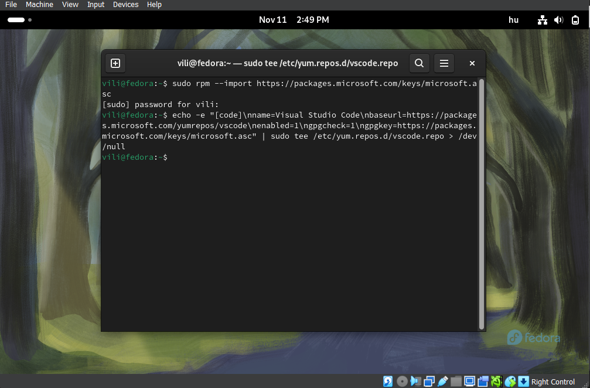
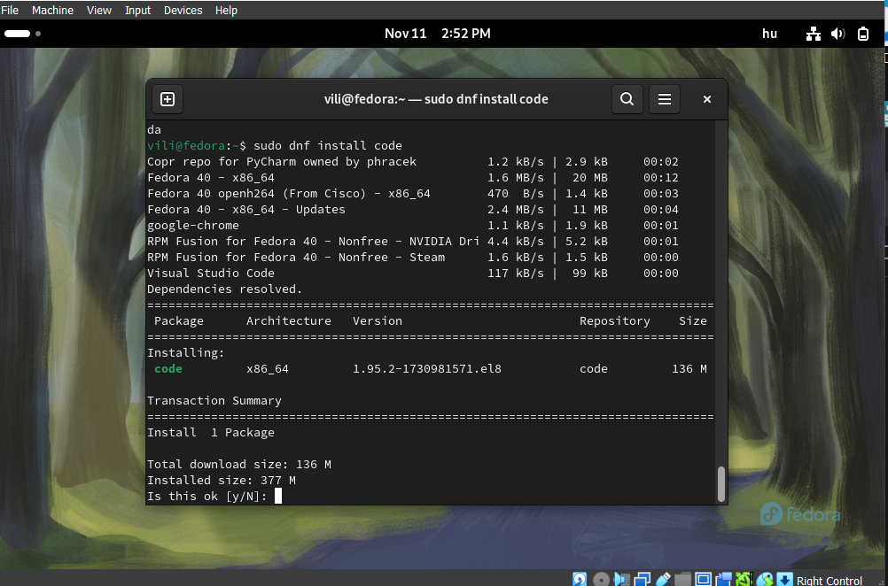
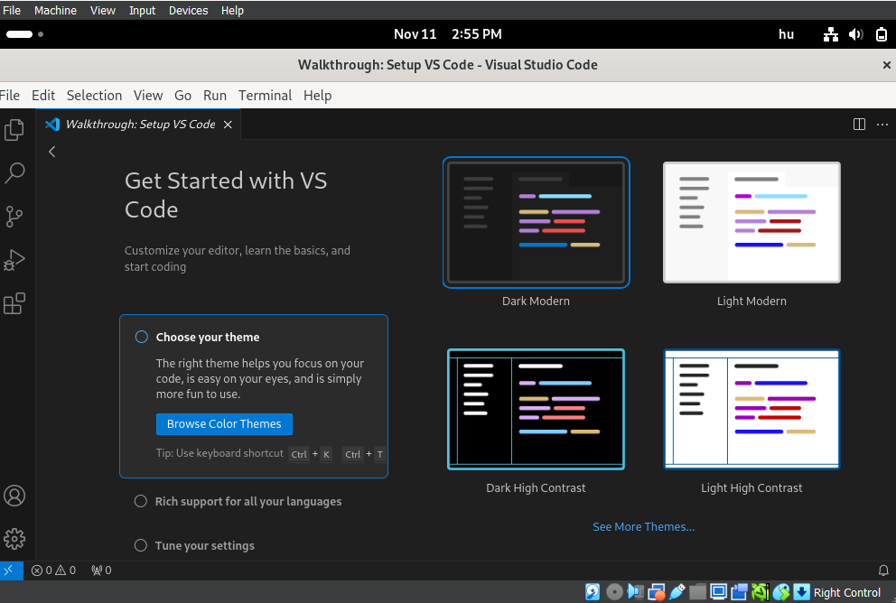

# Visual Studio Code telepítése Fedora linux rendszerre

## Nyissunk meg egy terminált   
1.  Először írjuk be a következő parancsot:  
`sudo rpm --import https://packages.microsoft.com/keys/microsoft.asc`
2. Lépésként írjuk be a következő parancsot:  
`echo -e "[code]\nname=Visual Studio Code\nbaseurl=https://packages.microsoft.com/yumrepos/vscode\nenabled=1\ngpgcheck=1\ngpgkey=https://packages.microsoft.com/keys/microsoft.asc" | sudo tee /etc/yum.repos.d/vscode.repo > /dev/null`
(Kérni fogja a jelszót)

3. Lépésként ellenőrizzük, hogy naprakészek az alkalmazások a rendszerünkön:    
`dnf check-update`
4. Lépésként teleptísük a Visual Studio Code alkalmazást a következő parancs segítségével:  
`sudo dnf install code`     
Írjunk be egy "y" betűt a telepítés megkezdéséhez

 

### A program használatra kész a Fedora rendszerünkön
*Megnyitásához* Kikereshetjük az **alkalmazások között** a Visual Studio Code-ot, vagy beírhatjuk a **terminálba**: `code`

