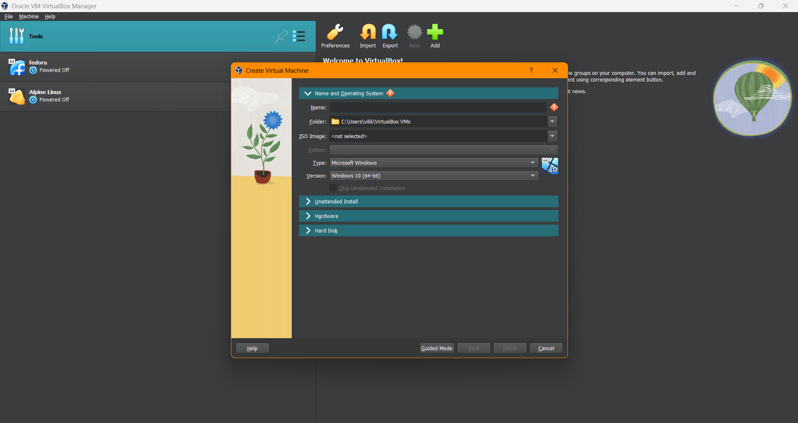
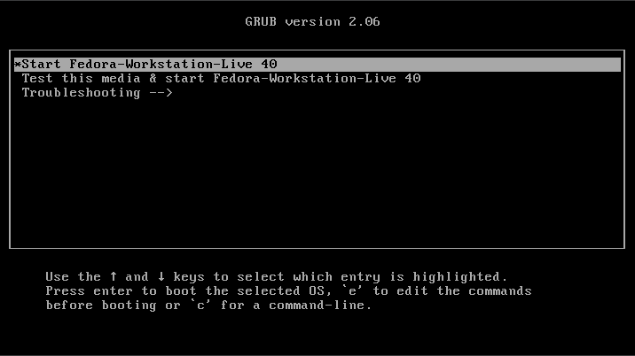
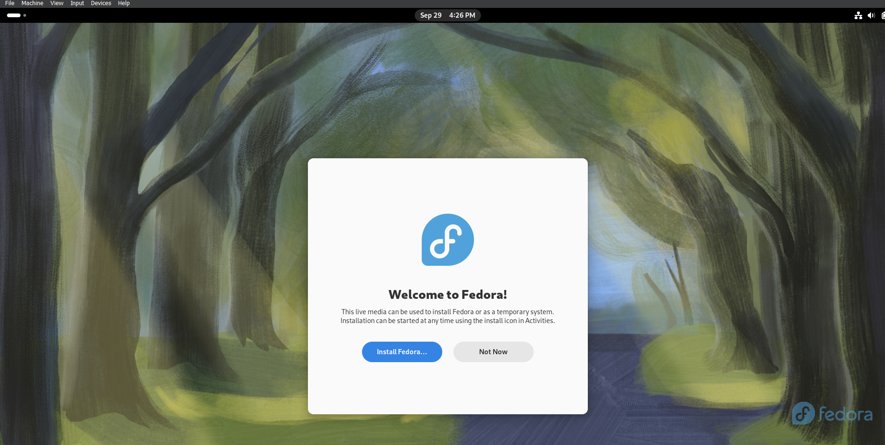
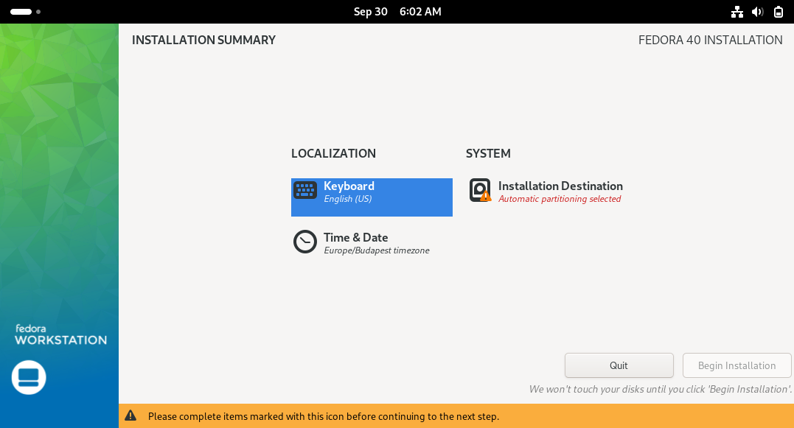

# Fedora telepítési útmutató 
## Virtuális számítógép létrehozása
-Telepítsük fel az Oracle Virtualbox alkalmazást.
[Itt tölthettő le](https://www.virtualbox.org/)

-Töltsük le az operációs rendszer telepítő fájlt.  amelyet a [alábbi
weboldalon](https://fedoraproject.org/) érhetünk el.

-Az alkalmazás megnyitása után __"New"__
>Írja be a virtuális gép nevét.  
Válassza ki a mentés helyét.
Az __ISO Image__-hez tallóza a letöltött rendszerfájlt.  

## Operációs rendszer telepítése

1. A telepítő letöltése után a lemezképfájlt(ISO) tetszőlegesen kiírhatjuk **lemezre**, vagy **pendrive**-ra is tehetjük 
(virtuális gép telepítése esetén egyikre sincs szükség).

2. Amennyiben sikeresen elkészítettünk egy telepítő adathordozót, helyezzük be abba a számítógépbe, amelyre telepíteni szeretnék a Fedora operációs rendszert.

3. Lépjünk be a számítógépen **BIOS/UEFI** módba, majd ott a **boot** szekción belül válasszuk ki a már kész telepítő adathordozónkat.

4. **Mentsük** el a módosítást, majd lépjünk ki a **BIOS/UEFI** módból.

5. A kilépés után elindul a telepítő varázsló, haladjunk végig a lépéseken.     

>Bootolás után vállasszuk ki a *Start Fedora-Workstation-Live 40* menüpontot

>Ha betöltött a rendszer, kattintsunk az *Install fedora* gombra

>Következő lépésben válasszuk ki a számunkra megfelelő nyelvet

>Kattintsunk az *Installation Destination* gombra, majd válasszuk ki a háttértárolónkat, utána *Done* gomb.

>*Begin Installation*  
-ez a folyamat eltarthat egy ideig.